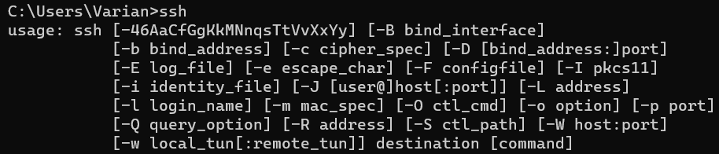
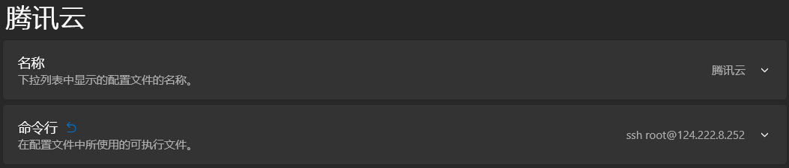
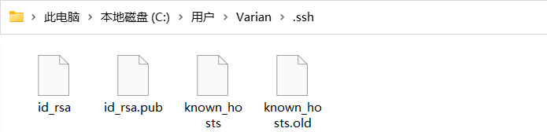

# Windows 实现 SSH 免密登录

## 一、下载OpenSSH

在命令行输入ssh，如果出现以下内容说明已经安装OpenSSH

如果没有则需要自行安装：

`win + i` 打开设置 -> 找到应用 -> 应用和功能 -> 可选功能 -> 添加功能， 安装OpenSSH客户端 和 OpenSSH服务器

## 二、添加远程服务器

在 Windows Terminal 的设置中新建空配置文件，配置名称和命令行

## 三、配置免密钥登录

### 1.生成密钥文件

首先，在cmd下输入`ssh-keygen`，系统会自动在 C: \Users\ 用户名\ .ssh 下生成这两个文件，如下图：

### 2. 发送密钥

将 id_rsa.pub 上传至服务器的 .ssh 目录，因为在服务器端的 .ssh 目录下也存在一个 id_rsa.pub文件，（如果 Linux 下没有这个文件，则输入ssh-keygen，会在 /root/.ssh 文件夹下生成密钥）所以为了避免混淆，我们复制一个出来，并改名为 id_rsa.pub.windows

### 3. 追加密钥文件

将传输过来的公钥追加入密钥文件：`cat id_rsa.pub.windows >> authorized_keys`
（若是没有 authorized_keys 这个文件，请自行创建）