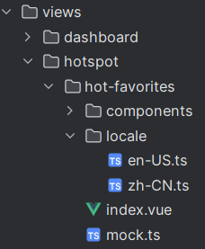

# 添加路由和菜单

## src/views

创建文件夹，添加组件，如一级菜单hotspot，二级菜单hot-favorites。



修改二级菜单中 locale，添加二级标题名：

```ts
export default {
  'menu.hotspot.hot-favorites': '热门收藏',
};
```


## src/locale

添加一级标题，引入 views 里的 locale 文件：

```ts
import localeHotFavorites from '@/views/hotspot/hot-favorites/locale/zh-CN';
export default {
    'menu.hotspot': '微博热点',
  ...localeHotFavorites,
};
```


## src/router

在 routers/modules 文件夹中创建以一级菜单为名的 ts 文件，在其中添加路由：

```typescript
import { DEFAULT_LAYOUT } from '../base';
import { AppRouteRecordRaw } from '../types';

//修改名字
const HOTSPOT: AppRouteRecordRaw = {
  path: '/hotspot',
  name: 'hotspot',
  component: DEFAULT_LAYOUT,
  meta: {
    locale: 'menu.hotspot',
    requiresAuth: true,
    icon: 'icon-dashboard',
    order: 2,
  },
  children: [
    {
      path: 'hot-favorites',
      name: 'hot-favorites',
      component: () => import('@/views/hotspot/hot-favorites/index.vue'),
      meta: {
        locale: 'menu.hotspot.hot-favorites',
        requiresAuth: true,
        roles: ['*'],
      },
    },
  ],
};
// 修改名字
export default HOTSPOT;
```

