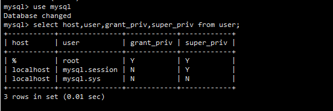
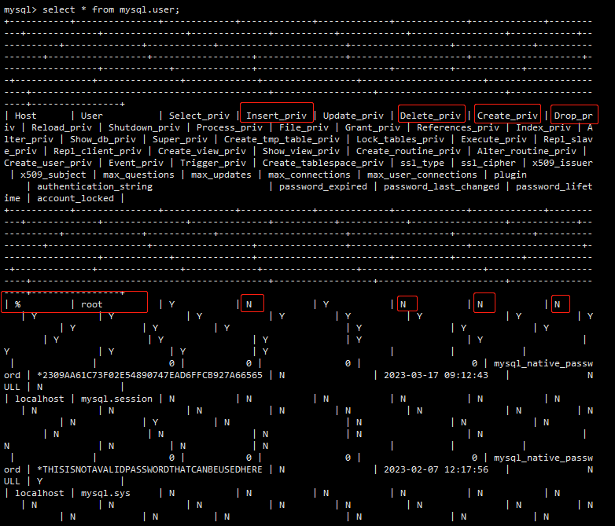

## Access denied for user 'root'@'%' to database 'xxxx'

[MySQL错误：Access denied for user 'root'@'%' to database 'xxx' - 我想养只狗 - 博客园 (cnblogs.com)](https://www.cnblogs.com/Dog1363786601/p/17226101.html)

看看root用户权限，是不是有欠缺。切换到mysql库

```my
use mysql;
```

命令行执行：

```mysql
select host,user,grant_priv,super_priv from user;
```



看到的信息太少了，root用户看到的这些都没问题，于是乎多查询些信息，找有用的。执行

```mysql
select * from mysql.user;
```

果不其然！！！ 发现了问题，就是权限问题



### 解决

执行命令给授权

```mysql
update mysql.user set Insert_priv='Y',Update_priv='Y',Delete_priv='Y',Create_priv='Y',Drop_priv='Y' where user = 'root' and host = '%';
```

刷新权限

```
flush privileges;
```

退出登录。重启mysql服务。**注意：一定要重启**

```sh
service mysql restart
```

登录mysql，执行授权命令

```mysql
grant all privileges on *.* to 'root'@'%' identified by 'nopassword' with grant option;
```

