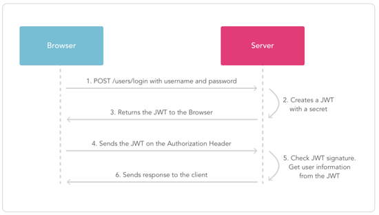
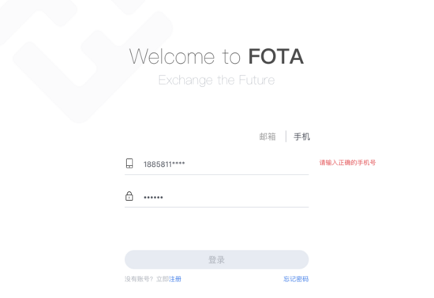
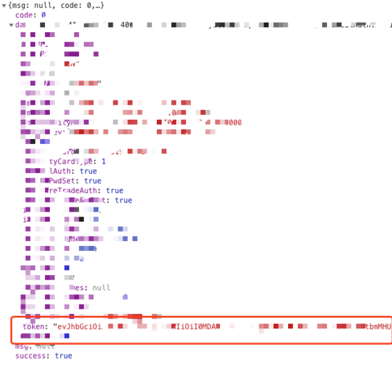
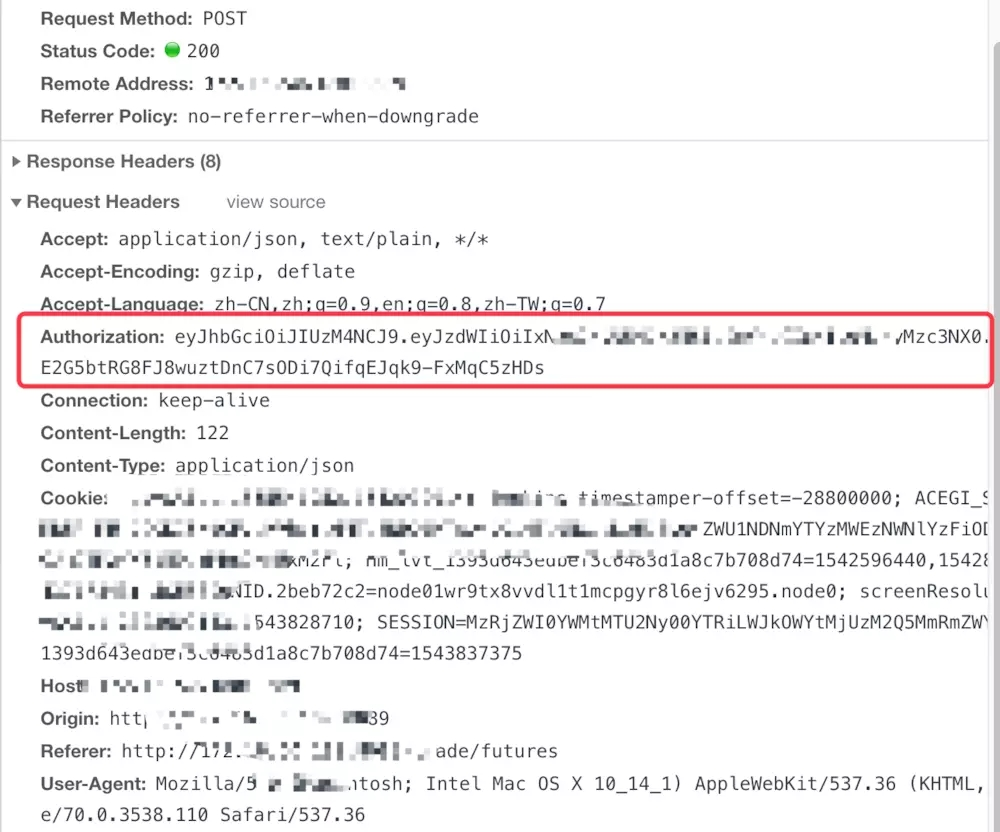

# Java中使用JWT生成Token进行接口鉴权实现方法

[Java中使用JWT生成Token进行接口鉴权实现方法 - java基础 - 谷谷点程序 (3qphp.com)](http://www.3qphp.com/java/Jgrammar/3514.html)

## 利用JWT进行鉴权的思路

1、用户发起登录请求。

2、服务端创建一个加密后的JWT信息，作为Token返回。

3、在后续请求中JWT信息作为请求头，发给服务端。

4、服务端拿到JWT之后进行解密，正确解密表示此次请求合法，验证通过；解密失败说明Token无效或者已过期。

流程图如下：

## 一、发起登录请求

用户发起登录请求



## 二、服务端返回Token

服务端创建一个加密后的JWT信息，作为Token返回

1、用户登录之后把生成的Token返回给前端

```java
@Authorization
@ResponseBody
@GetMapping("user/auth")
public Result getUserSecurityInfo(HttpServletRequest request) {
 try {
  UserDTO userDTO = ...
  UserVO userVO = new UserVO();
  //这里调用创建JWT信息的方法
  userVO.setToken(TokenUtil.createJWT(String.valueOf(userDTO.getId())));
  return Result.success(userVO);
 } catch (Exception e) {
  return Result.fail(ErrorEnum.SYSTEM_ERROR);
 }
}
```

2、创建JWT，Generate Tokens

```java
import javax.crypto.spec.SecretKeySpec;
import javax.xml.bind.DatatypeConverter;
import java.security.Key;
import io.jsonwebtoken.*;
import java.util.Date; 
 
//Sample method to construct a JWT
private String createJWT(String id, String issuer, String subject, long ttlMillis) {
 
 //The JWT signature algorithm we will be using to sign the token
 SignatureAlgorithm signatureAlgorithm = SignatureAlgorithm.HS256;
 
 long nowMillis = System.currentTimeMillis();
 Date now = new Date(nowMillis);
 
 //We will sign our JWT with our ApiKey secret
 byte[] apiKeySecretBytes = DatatypeConverter.parseBase64Binary(apiKey.getSecret());
 Key signingKey = new SecretKeySpec(apiKeySecretBytes, signatureAlgorithm.getJcaName());
 
 //Let's set the JWT Claims
 JwtBuilder builder = Jwts.builder().setId(id)
        .setIssuedAt(now)
        .setSubject(subject)
        .setIssuer(issuer)
        .signWith(signatureAlgorithm, signingKey);
 
 //if it has been specified, let's add the expiration
 if (ttlMillis >= 0) {
 long expMillis = nowMillis + ttlMillis;
  Date exp = new Date(expMillis);
  builder.setExpiration(exp);
 }
 
 //Builds the JWT and serializes it to a compact, URL-safe string
 return builder.compact();
}
```

3、作为Token返回



## 三、请求头加入JWT信息

在后续请求中JWT信息作为请求头，发给服务端



## 四、验证

服务端拿到JWT之后进行解密，正确解密表示此次请求合法，验证通过；解密失败说明Token无效或者已过期。

1、在拦截器中读取这个Header里面的Token值

```java
@Slf4j
@Component
public class AuthorizationInterceptor extends HandlerInterceptorAdapter {
 private boolean chechToken(HttpServletRequest request, HttpServletResponse response) throws IOException{
  Long userId = ...;

  if (!TokenUtil.parseJWT(request.getHeader("Authorization"), String.valueOf(userId))){
   response.setContentType("text/html;charset=GBK");
   response.setCharacterEncoding("GBK");
   response.setStatus(403);
   response.getWriter().print("<font size=6 color=red>对不起，您的请求非法，系统拒绝响应!</font>");
   return false;
  } else{
   return true;
  }
 }
}
```

2、拿到之后进行解密校验

Decode and Verify Tokens

```java
import javax.xml.bind.DatatypeConverter;
import io.jsonwebtoken.Jwts;
import io.jsonwebtoken.Claims;
 
//Sample method to validate and read the JWT
private void parseJWT(String jwt) {
 //This line will throw an exception if it is not a signed JWS (as expected)
 Claims claims = Jwts.parser()   
  .setSigningKey(DatatypeConverter.parseBase64Binary(apiKey.getSecret()))
  .parseClaimsJws(jwt).getBody();
 System.out.println("ID: " + claims.getId());
 System.out.println("Subject: " + claims.getSubject());
 System.out.println("Issuer: " + claims.getIssuer());
 System.out.println("Expiration: " + claims.getExpiration());
}
```

