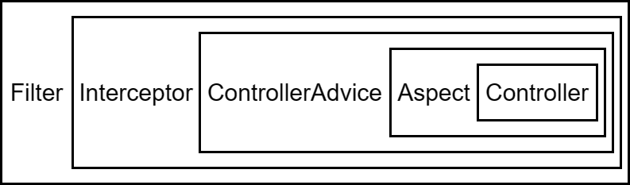
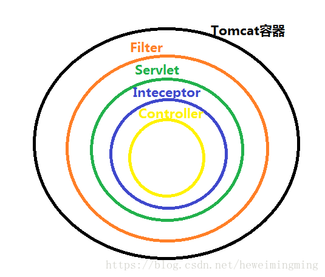
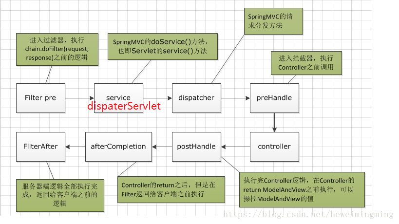

# Spring 中的过滤器 Filter、拦截器 Interceptor 、切片 Aspect详解

[Spring Interceptor vs Filter 拦截器和过滤器区别 | Verne in GitHub (einverne.github.io)](https://einverne.github.io/post/2017/08/spring-interceptor-vs-filter.html)

## 1 拦截机制

拦截机制有三种：

1. 过滤器（Filter）能拿到 http 请求，但是拿不到处理请求方法的信息。

2. 拦截器（Interceptor）既能拿到 http 请求信息，也能拿到处理请求方法的信息，但是拿不到方法的参数信息。

3. 切片（Aspect）能拿到方法的参数信息，但是拿不到 http 请求信息。

他们三个各有优缺点，需要根据自己的业务需求来选择最适合的拦截机制。

## 2 拦截器与过滤器之间的区别

- 作用域不同

   - 过滤器依赖于servlet容器，只能在 servlet容器，web环境下使用
   - 拦截器依赖于spring容器，可以在spring容器中调用，不管此时Spring处于什么环境

- 细粒度的不同

   - 过滤器的控制比较粗，只能在请求进来时进行处理，对请求和响应进行包装

   - 拦截器提供更精细的控制，可以在controller对请求处理之前或之后被调用，也可以在渲染视图呈现给用户之后调用

- 中断链执行的难易程度不同

   - 拦截器可以 preHandle方法内返回 false 进行中断

   - 过滤器就比较复杂，需要处理请求和响应对象来引发中断，需要额外的动作，比如将用户重定向到错误页面

[Spring Interceptor vs Filter 拦截器和过滤器区别 | Verne in GitHub (einverne.github.io)](https://einverne.github.io/post/2017/08/spring-interceptor-vs-filter.html)

| Filter                                                       | Interceptor                                                  | Summary                                                      |
| :----------------------------------------------------------- | :----------------------------------------------------------- | :----------------------------------------------------------- |
| Filter 接口定义在 javax.servlet 包中                         | 接口 HandlerInterceptor 定义在org.springframework.web.servlet 包中 |                                                              |
| Filter 定义在 web.xml 中                                     |                                                              |                                                              |
| Filter在只在 Servlet 前后起作用。Filters 通常将 请求和响应（request/response） 当做黑盒子，Filter 通常不考虑servlet 的实现。 | 拦截器能够深入到方法前后、异常抛出前后等，因此拦截器的使用具有更大的弹性。允许用户介入（hook into）请求的生命周期，在请求过程中获取信息，Interceptor 通常和请求更加耦合。 | 在Spring构架的程序中，要优先使用拦截器。几乎所有 Filter 能够做的事情， interceptor 都能够轻松的实现[1](https://einverne.github.io/post/2017/08/spring-interceptor-vs-filter.html#fn:top) |
| Filter 是 Servlet 规范规定的。                               | 而拦截器既可以用于Web程序，也可以用于Application、Swing程序中。 | 使用范围不同                                                 |
| Filter 是在 Servlet 规范中定义的，是 Servlet 容器支持的。    | 而拦截器是在 Spring容器内的，是Spring框架支持的。            | 规范不同                                                     |
| Filter 不能够使用 Spring 容器资源                            | 拦截器是一个Spring的组件，归Spring管理，配置在Spring文件中，因此能使用Spring里的任何资源、对象，例如 Service对象、数据源、事务管理等，通过IoC注入到拦截器即可 | Spring 中使用 interceptor 更容易                             |
| Filter 是被 Server(like Tomcat) 调用                         | Interceptor 是被 Spring 调用                                 | 因此 Filter 总是优先于 Interceptor 执行                      |

### 1 触发时机

过滤器和拦截器触发时机不一样，**过滤器是在请求进入容器后，但请求进入servlet之前进行预处理的。**请求结束返回也是，是在servlet处理完后，返回给前端之前。

### 2 Spring 支持

拦截器可以获取IOC容器中的各个bean，而过滤器就不行，因为拦截器是spring提供并管理的，spring的功能可以被拦截器使用，在拦截器里注入一个service，可以调用业务逻辑。而过滤器是JavaEE标准，只需依赖servlet api ，不需要依赖spring。

图中第2步，SpringMVC的机制是由DispaterServlet来分发请求给不同的Controller，其实这一步是在Servlet的service()方法中执行的.

### 3 实现机制

**过滤器的实现基于回调函数。而拦截器（代理模式）的实现基于反射，代理分静态代理和动态代理，动态代理是拦截器的简单实现**。

### 4 使用场景

1. **如果是非spring项目，那么拦截器不能用，只能使用过滤器。**
2. **如果是处理controller前后，既可以使用拦截器也可以使用过滤器。**
3. **如果是处理dispaterServlet前后，只能使用过滤器。**

## 3 interceptor 使用

interceptor 的执行顺序大致为：

1. 请求到达 DispatcherServlet
2. DispatcherServlet 发送至 Interceptor ，执行 preHandle
3. 请求达到 Controller
4. 请求结束后，postHandle 执行

Spring 中主要通过 HandlerInterceptor 接口来实现请求的拦截，实现 HandlerInterceptor 接口需要实现下面三个方法：

- **preHandle()** – 在handler执行之前，返回 boolean 值，true 表示继续执行，false 为停止执行并返回。
- **postHandle()** – 在handler执行之后, 可以在返回之前对返回的结果进行修改
- **afterCompletion()** – 在请求完全结束后调用，可以用来统计请求耗时等等

## 4 Filter 使用

Servlet 的 Filter 接口需要实现如下方法：

- `void init(FilterConfig paramFilterConfig)` – 当容器初始化 Filter 时调用，该方法在 Filter 的生命周期只会被调用一次，一般在该方法中初始化一些资源，FilterConfig 是容器提供给 Filter 的初始化参数，在该方法中可以抛出 ServletException 。init 方法必须执行成功，否则 Filter 可能不起作用，出现以下两种情况时，web 容器中 Filter 可能无效： 1）抛出 ServletException 2）超过 web 容器定义的执行时间。
- `doFilter(ServletRequest paramServletRequest, ServletResponse paramServletResponse, FilterChain paramFilterChain)` – Web 容器每一次请求都会调用该方法。该方法将容器的请求和响应作为参数传递进来， FilterChain 用来调用下一个 Filter。
- `void destroy()` – 当容器销毁 Filter 实例时调用该方法，可以在方法中销毁资源，该方法在 Filter 的生命周期只会被调用一次。

## 5 Filter 和 Interceptor 的一些用途

- Authentication Filters
- Logging and Auditing Filters
- Image conversion Filters
- Data compression Filters
- Encryption Filters
- Tokenizing Filters
- Filters that trigger resource access events
- XSL/T filters
- Mime-type chain Filter

Request Filters 可以:

- 执行安全检查 perform security checks
- 格式化请求头和主体 reformat request headers or bodies
- 审查或者记录日志 audit or log requests
- 根据请求内容授权或者限制用户访问 Authentication-Blocking requests based on user identity.
- 根据请求频率限制用户访问

Response Filters 可以:

- 压缩响应内容,比如让下载的内容更小 Compress the response stream
- 追加或者修改响应 append or alter the response stream
- 创建或者整体修改响应 create a different response altogether
- 根据地方不同修改响应内容 Localization-Targeting the request and response to a particular locale.