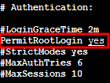
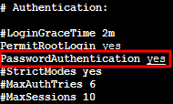

# Ubuntu 系统如何使用 root 用户登录实例

[轻量应用服务器 常见问题-文档中心-腾讯云 (tencent.com)](https://cloud.tencent.com/document/product/1207/44569#ubuntu-.E7.B3.BB.E7.BB.9F.E5.A6.82.E4.BD.95.E4.BD.BF.E7.94.A8-root-.E7.94.A8.E6.88.B7.E7.99.BB.E5.BD.95.E5.AE.9E.E4.BE.8B.EF.BC.9F)

Ubuntu 系统的默认用户名是 ubuntu，并在安装过程中默认不设置 root 帐户和密码。您如有需要，可在设置中开启允许 root 用户登录。具体操作步骤如下：

1. 使用 ubuntu 帐户登录轻量应用服务器。

   

2. 执行以下命令，设置 root 密码。

   ```sh
   sudo passwd root
   ```

   

3. 输入 root 的密码，按 **Enter**。

   

4. 重复输入 root 的密码，按 **Enter**。

   返回如下信息，即表示 root 密码设置成功。

   ```sh
   passwd: password updated successfully
   ```

   

5. 执行以下命令，打开 `sshd_config` 配置文件。

   ```sh
   sudo vi /etc/ssh/sshd_config 
   ```

   

6. 按 **i** 切换至编辑模式，找到 `#Authentication`，将 `PermitRootLogin` 参数修改为 `yes`。如果 `PermitRootLogin` 参数被注释，请去掉首行的注释符号（`#`）。如下图所示：

   

   

7. 找到 `#Authentication`，将 `PasswordAuthentication` 参数修改为 yes。如下图所示：

   > **说明**
   >
   > 若 `sshd_config` 配置文件中无此配置项，则添加 `PasswordAuthentication yes` 项即可。

   

   

8. 按 **Esc**，输入**:wq**，保存文件并返回。

   

9. 执行以下命令，重启 ssh 服务。

   ```sh
   sudo service ssh restart
   ```

   

10. 参见[使用远程登录软件登录 Linux 实例](https://cloud.tencent.com/document/product/1207/44578)，并使用以下信息登录 Ubuntu 轻量应用服务器：

    > **用户名：**root
    >
    > **登录密码**：在步骤2中已设置的密码