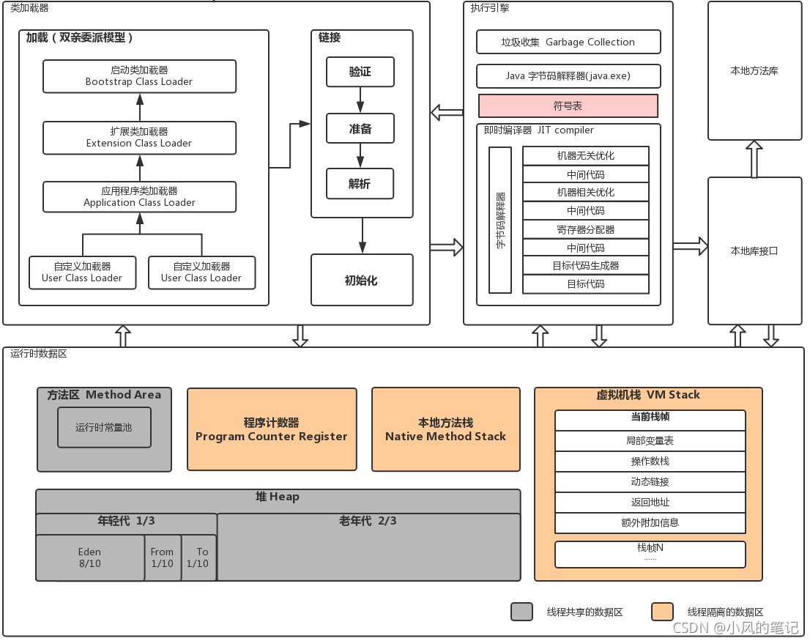
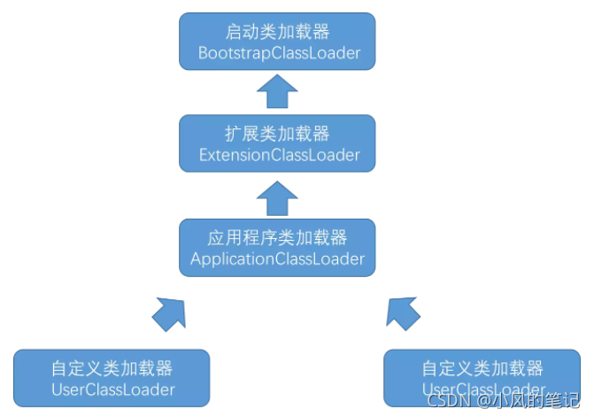
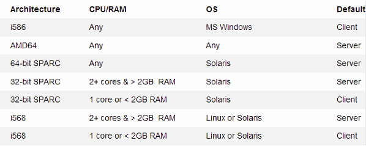
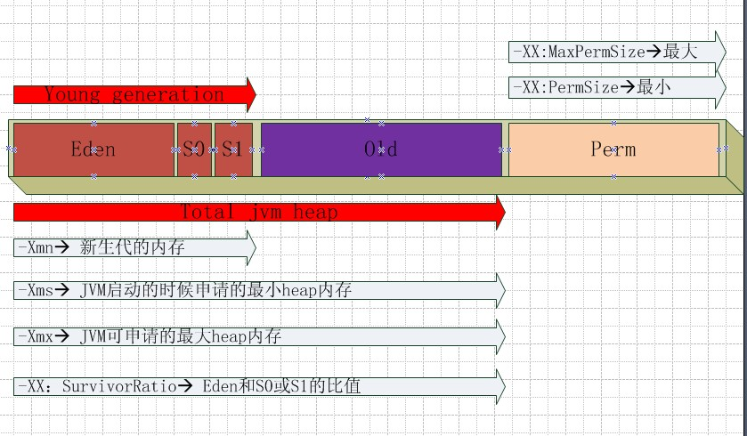
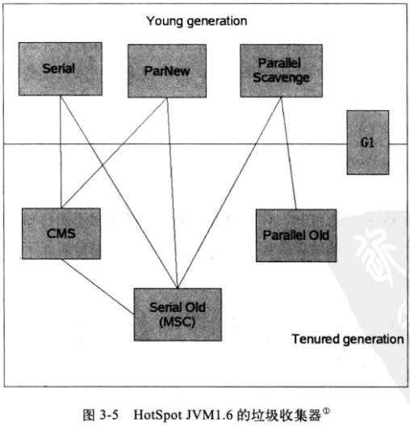
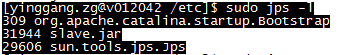
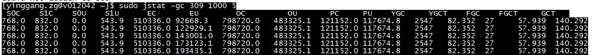
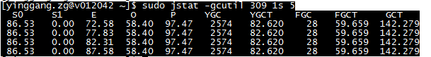
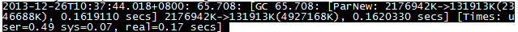
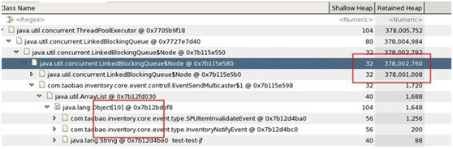

# JVM

## 一、了解JVM

### 1、什么是JVM

JVM是Java Virtual Machine（Java虚拟机）的缩写，是一个虚构出来的计算机，是通过在实际的计算机上仿真模拟计算机功能来实现的，JVM屏蔽了与具体操作系统平台相关的信息，Java程序只需生成在Java虚拟机上运行的字节码，就可以在多种平台上不加修改的运行。JVM在执行字节码时，实际上最终还是把字节码解释成具体平台上的机器指令执行。

### 2、JRE/JDK/JVM是什么关系

JRE（Java Runtime Environment）：是Java运行环境，所有的Java程序都要在JRE下才能运行。
JDK（Java Development Kit）：是Java开发工具包，它是程序开发者用来编译、调试Java程序，它也是Java程序，也需要JRE才能运行。
JVM（Java Virual Machine）：是Java虚拟机，它是JRE的一部分，一个虚构出来的计算机，它支持跨平台。

### 3、JVM体系结构：

类加载器：加载class文件；
运行时数据区：包括方法区、堆、Java栈、程序计数器、本地方法栈
执行引擎：执行字节码或者执行本地方法

二、运行时数据区
方法区：属于共享内存区域，存储已被虚拟机加载的类信息、常量、静态变量、即时编译器编译后的代码等数据。

堆：Java虚拟机所管理的内存中最大的一块，唯一的目的是存放对象实例。由于是垃圾收集器管理的主要区域，因此有时候也被称作GC堆。

栈：用于描述Java方法执行的模型。每个方法在执行的同时都会创建一个栈帧，用于存储局部变量表、操作数栈、动态链接、方法出口等信息。每一个方法从调用至执行完成，对应于一个栈帧在虚拟机栈中从入栈到出栈。

程序计数器：当前线程所执行字节码的行号指示器。每一个线程都有一个独立的程序计数器，线程的阻塞、恢复、挂起等一系列操作都需要程序计数器的参与，因此必须是线程私有的。

本地方法栈：与虚拟机栈作用相似，只不过虚拟机栈为执行Java方法服务，而本地方法栈为执行Native方法服务，比如在Java中调用C/C++。

## 三、类加载机制

类加载器通过一个类的全限定名来获取描述此类的二进制文件流的代码模块。

### 1、类的生命周期(7个)

加载、验证、准备、解析、初始化、使用、卸载

### 2、类加载的五个过程

虚拟机把描述类的数据从 Class 文件加载到内存，并对数据进行校验、装换解析和初始化，最终形成可以被虚拟机直接使用的 Java 类型。

加载：类加载器获取二进制字节流，将静态存储结构转化为方法区的运行时数据结构，并生成此类的Class对象。

验证：验证文件格式、元数据、字节码、符号引用，确保Class的字节流中包含的信息符合当前虚拟机的要求。

准备：为类变量分配内存并设置其初始值，这些变量使用的内存都将在方法区中进行分配。

解析：将常量池内的符号引用替换为直接引用，包括类或接口的解析、字段解析、类方法解析、接口方法解析。

初始化：前面过程都是以虚拟机主导，而初始化阶段开始执行类中的 Java 代码。

### 3、类加载器

启动类加载器(BootStrap ClassLoader)：主要负责加载jre/lib/rt.jar相关的字节码文件的。

扩展类加载器(Extension Class Loader)：主要负载加载 jre/lib/ext/*.jar 这些jar包的。

应用程序类加载器(Application Class Loader)：主要负责加载用户自定义的类以及classpath环境变量所配置的jar包的。

自定义类加载器(User Class Loader)：负责加载程序员指定的特殊目录下的字节码文件的。大多数情况下，自定义类加载器只需要继承ClassLoader这个抽象类，重写findClass()和loadClass()两个方法即可。

### 4、类加载机制（双亲委派）

类的加载是通过双亲委派模型来完成的，双亲委派模型即为下图所示的类加载器之间的层次关系。

工作过程：如果一个类加载器接收到类加载的请求，它会先把这个请求委派给父加载器去完成，只有当父加载器反馈自己无法完成加载请求时，子加载器才会尝试自己去加载。可以得知，所有的加载请求最终都会传送到启动类加载器中。

## 四、垃圾回收

程序计数器、虚拟机栈、本地方法栈是线程私有的，所以会随着线程结束而消亡。 Java 堆和方法区是线程共享的，在程序处于运行期才知道哪些对象会创建，这部分内存的分配和回收都是动态的，垃圾回收所关注的就是这部分内存。

### 1、判断对象已死

在进行内存回收之前要做的事情就是判断那些对象是‘死’的，哪些是‘活’的。

引用计数法：给对象中添加一个引用计数器，当一个地方引用了对象，计数加1；当引用失效，计数器减1；当计数器为0表示该对象已死、可回收；

注意：如果不下小心直接把 Obj1-reference 和 Obj2-reference 置 null。则在 Java 堆当中的两块内存依然保持着互相引用无法回收。引用计数法很难解决循环引用问题；
可达性分析：通过一系列的 ‘GC Roots’ 的对象作为起始点，从这些节点出发所走过的路径称为引用链。当一个对象到 GC Roots 没有任何引用链相连的时候说明对象不可用。

可作为 GC Roots 的对象：
1）虚拟机栈中引用的对象
2）方法区中类静态属性引用的对象
3）方法区中常量引用的对象
4）本地方法栈中native方法引用的对象
引用：下面四种引用强度依次减弱
强引用：默认情况下，对象采用的均为强引用；
软引用：SoftReference 类实现软引用。在系统要发生内存溢出异常之前，将会把这些对象列进回收范围之中进行二次回收。
弱引用：WeakReference 类实现弱引用。对象只能生存到下一次垃圾收集之前。在垃圾收集器工作时，无论内存是否足够都会回收掉只被弱引用关联的对象。
虚引用：PhantomReference 类实现虚引用。无法通过虚引用获取一个对象的实例，为一个对象设置虚引用关联的唯一目的就是能在这个对象被收集器回收时收到一个系统通知。

### 2、垃圾收集算法

标记清除算法：先标记出所有需要回收的对象，标记完成后统一回收所有被标记的对象。
复制算法：将可用内存分为大小相等的两块，每次只使用其中一块，当这一块内存用完了，就将存活的对象复制到另一块，最后将此块内存一次性清理掉。
标记整理算法：先标记所有需要回收的对象，然后让所有存活的对象向一端移动，最后直接清理掉边界以外的另一端内存。
分代收集算法：把Java堆分为新生代和老年代。新生代中只有少量对象会存活，就选用复制算法；老年代中对象存活率较高，选用标记清除算法。

### 3、垃圾收集器

Serial收集器：单线程收集器。收集垃圾时必须暂停其他所有工作线程，直到它收集结束。
Parnew收集器：Serial收集器多线程版本。
Parallel Scavenge收集器：使用复制算法的新生代收集器。
Serial Old收集器：使用标记-整理算法的老年代单线程收集器。
Parallel Old收集器：使用标记-整理算法的老年代多线程收集器。
CMS收集器：基于标记-清除算法的低停顿并发收集器。运作步骤为①初始标记②并发标记③重新标记④并发清除。
G1收集器：最前沿的面向服务端应用的垃圾收集器。运作步骤为①初始标记②并发标记③最终标记④筛选回收。
G1收集器有以下特点
1）并行与并发：无需停顿Java线程来执行GC动作。
2）分代收集：可独立管理整个GC堆。
3）空间整合：运行期间不会产生内存空间碎片。
4）可预测的停顿：除了低停顿，还能建立可预测的停顿时间模型。

### 4、JVM内存分代机制

方法区即被称为永久代，而堆中存放的是对象实例，为了回收的时候对不同的对象采用不同的方法，又将堆分为新生代和老年代，默认情况下新生代占堆的1/3，老年代占堆的2/3。

新生代（Young）：HotSpot将新生代划分为三块，一块较大的Eden空间和两块较小的Survivor空间，默认比例为8：1：1。
老年代（Old）：在新生代中经历了多次GC后仍然存活下来的对象会进入老年代中。老年代中的对象生命周期较长，存活率比较高，在老年代中进行GC的频率相对而言较低，而且回收的速度也比较慢。
永久代（Permanent）：永久代存储类信息、常量、静态变量、即时编译器编译后的代码等数据，对这一区域而言，一般而言不会进行垃圾回收。
元空间（metaspace）：从JDK 8开始，Java开始使用元空间取代永久代，元空间并不在虚拟机中，而是直接使用本地内存。那么，默认情况下，元空间的大小仅受本地内存限制。当然，也可以对元空间的大小手动的配置。
GC 过程：新生成的对象在Eden区分配（大对象除外，大对象直接进入老年代），当Eden区没有足够的空间进行分配时，虚拟机将发起一次Minor GC。GC开始时，对象只会存在于Eden区和Survivor From区，Survivor To区是空的（作为保留区域）。GC进行时，Eden区中所有存活的对象都会被复制到Survivor To区，而在Survivor From区中，仍存活的对象会根据它们的年龄值决定去向，年龄值达到年龄阀值（默认为15，新生代中的对象每熬过一轮垃圾回收，年龄值就加1，GC分代年龄存储在对象的Header中）的对象会被移到老年代中，没有达到阀值的对象会被复制到Survivor To区。接着清空Eden区和Survivor From区，新生代中存活的对象都在Survivor To区。接着，Survivor From区和Survivor To区会交换它们的角色，也就是新的Survivor To区就是上次GC清空的Survivor From区，新的Survivor From区就是上次GC的Survivor To区，总之，不管怎样都会保证Survivor To区在一轮GC后是空的。GC时当Survivor To区没有足够的空间存放上一次新生代收集下来的存活对象时，需要依赖老年代进行分配担保，将这些对象存放在老年代中。

### 5、Minor GC、Major GC、Full GC之间的区别

Minor GC：Minor GC指新生代GC，即发生在新生代（包括Eden区和Survivor区）的垃圾回收操作，当新生代无法为新生对象分配内存空间的时候，会触发Minor GC。因为新生代中大多数对象的生命周期都很短，所以发生Minor GC的频率很高，虽然它会触发stop-the-world，但是它的回收速度很快。
Major GC：指发生在老年代的垃圾收集动作，出现了 Major GC，经常会伴随至少一次 Minor GC（非绝对），MajorGC 的速度一般会比 Minor GC 慢10倍以上。
Full GC：Full GC是针对整个新生代、老生代、元空间（metaspace，java8以上版本取代perm gen）的全局范围的GC。Full GC不等于Major GC，也不等于Minor GC+Major GC，发生Full GC需要看使用了什么垃圾收集器组合，才能解释是什么样的垃圾回收。

### 6、Minor GC、Major GC、Full GC触发条件

Minor GC触发条件：
虚拟机在进行minorGC之前会判断老年代最大的可用连续空间是否大于新生代的所有对象总空间
1）如果大于的话，直接执行minorGC
2）如果小于，判断是否开启HandlerPromotionFailure，没有开启直接FullGC
3）如果开启了HanlerPromotionFailure, JVM会判断老年代的最大连续内存空间是否大于历次晋升（晋级老年代对象的平均大小）平均值的大小，如果小于直接执行FullGC
4）如果大于的话，执行minorGC
Full GC触发条件：
1）老年代空间不足：如果创建一个大对象，Eden区域当中放不下这个大对象，会直接保存在老年代当中，如果老年代空间也不足，就会触发Full GC。为了避免这种情况，最好就是不要创建太大的对象。
2）方法区空间不足：系统当中需要加载的类，调用的方法很多，同时方法区当中没有足够的空间，就出触发一次Full GC
3）老年代最大可用连续空间小于Minor GC历次晋升到老年代对象的平均大小
4）调用System.gc()时（系统建议执行Full GC，但是不必然执行）

## 五、JVM监控和调优

光说不练假把式，学习Java GC机制的目的是为了实用，也就是为了在JVM出现问题时分析原因并解决之。通过学习，我觉得JVM监控与调优主要的着眼点在于如何配置、如何监控、如何优化3点上。下面就将针对这3点进行学习。
   （如果您对Java的内存区域划分和内存回收机制尚不明确，那在阅读本文前，请先阅读我的前一篇博客《[Java系列笔记(3) - Java 内存区域和GC机制](http://www.cnblogs.com/zhguang/p/3257367.html)》，在该博客中，详细叙述了Java HotSpot虚拟机（Sun/Oracle JDK系列默认的虚拟机）的内存分配和垃圾回收机制。本文很多内容将依据上一篇博客，同时，本文所针对的虚拟机，也是HotSpot虚拟机。）

### 参数设置

 在Java虚拟机的参数中，有3种表示方法（出自：http://www.cnblogs.com/wenfeng762/archive/2011/08/14/2137810.html），用“ps -ef |grep "java"命令，可以得到当前Java进程的所有启动参数和配置参数：

- 标准参数（-），所有的JVM实现都必须实现这些参数的功能，而且向后兼容；
- 非标准参数（-X），默认jvm实现这些参数的功能，但是并不保证所有jvm实现都满足，且不保证向后兼容；
- 非Stable参数（-XX），此类参数各个jvm实现会有所不同，将来可能会随时取消，需要慎重使用（但是，这些参数往往是非常有用的）；

（额外的，-DpropertyName=“value”的形式定义了一些全局属性值，下面有介绍。）
本文只重点介绍一些重要和常用的参数，如果想了解全部参数，可以参考下面的文章：

《[Java HotSpot VM Options](http://www.oracle.com/technetwork/java/javase/tech/vmoptions-jsp-140102.html)》

《[Java 6 JVM参数选项大全（中文版）](http://kenwublog.com/docs/java6-jvm-options-chinese-edition.htm)》（上面一篇的中文版）

《[JVM启动参数大全](http://www.blogjava.net/midstr/archive/2008/09/21/230265.html)》

 

### 标准参数

其实标准参数是用过Java的人都最熟悉的，就是你在运行java命令时后面加上的参数，如java -version, java -jar 等，输入命令java -help或java -?就能获得当前机器所有java的标准参数列表。
-client
设置jvm使用client模式，这是一般在pc机器上使用的模式，启动很快，但性能和内存管理效率并不高；多用于桌面应用；

-server
使用server模式，启动速度虽然慢（比client模式慢10%左右），但是性能和内存管理效率很高，适用于服务器，用于生成环境、开发环境或测试环境的服务端；
如果没有指定-server或-client，JVM启动的时候会自动检测当前主机是否为服务器，如果是就以server模式启动，64位的JVM只有server模式，所以无法使用-client参数；
默认情况下，不同的启动模式，执行GC的方式有所区别：

| 启动模式 | 新生代GC方式 | 旧生代和持久代GC的方式 |
| -------- | ------------ | ---------------------- |
| client   | 串行         | 串行                   |
| server   | 并行         | 并发                   |

如果没有指定-server或-client模式，则判断方法如下：

-classpath / -cp
JVM加载和搜索文件的目录路径，多个路径用;分隔。注意，如果使用了-classpath，JVM就不会再搜索环境变量中定义的CLASSPATH路径。
JVM搜索路径的顺序为：
1，先搜索JVM自带的jar或zip包（Bootstrat，搜索路径可以用System.getProperty("sun.boot.class.path")获得）；
2，搜索JRE_HOME/lib/ext下的jar包（Extension，搜索路径可以用System.getProperty("java.ext.dirs")获得）；
3，搜索用户自定义目录，顺序为：当前目录（.），CLASSPATH，-cp；（搜索路径用System.getProperty("java.class.path")获得）

-DpropertyName=value
定义系统的全局属性值，如配置文件地址等，如果value有空格，可以用-Dname="space string"这样的形式来定义，用System.getProperty("propertyName")可以获得这些定义的属性值，在代码中也可以用System.setProperty("propertyName","value")的形式来定义属性。

-verbose
这是查询GC问题最常用的命令之一，具体参数如：
-verbose:class
 输出jvm载入类的相关信息，当jvm报告说找不到类或者类冲突时可此进行诊断。
-verbose:gc
 输出每次GC的相关情况，后面会有更详细的介绍。
-verbose:jni
 输出native方法调用的相关情况，一般用于诊断jni调用错误信息。

### 非标准参数

非标准参数，是在标准参数的基础上进行扩展的参数，输入“java -X”命令，能够获得当前JVM支持的所有非标准参数列表（你会发现，其实并不多哦）。

在不同类型的JVM中，采用的参数有所不同，
在讲解非标准参数时，请参考下面的图，对内存区域的大小有个形象的了解（下图出自：http://iamzhongyong.iteye.com/blog/1333100）：

-Xmn
新生代内存大小的最大值，包括E区和两个S区的总和，使用方法如：-Xmn65535，-Xmn1024k，-Xmn512m，-Xmn1g (-Xms,-Xmx也是种写法)
-Xmn只能使用在JDK1.4或之后的版本中，（之前的1.3/1.4版本中，可使用-XX:NewSize设置年轻代大小，用-XX:MaxNewSize设置年轻代最大值）；
如果同时设置了-Xmn和-XX:NewSize，-XX:MaxNewSize，则谁设置在后面，谁就生效；如果同时设置了-XX:NewSize -XX:MaxNewSize与-XX:NewRatio则实际生效的值是：min(MaxNewSize,max(NewSize, heap/(NewRatio+1)))（看考：http://www.open-open.com/home/space.php?uid=71669&do=blog&id=8891）
在开发、测试环境，可以-XX:NewSize 和 -XX:MaxNewSize来设置新生代大小，但在线上生产环境，使用-Xmn一个即可（推荐），或者将-XX:NewSize 和 -XX:MaxNewSize设置为同一个值，这样能够防止在每次GC之后都要调整堆的大小（即：抖动，抖动会严重影响性能）

 -Xms
初始堆的大小，也是堆大小的最小值，默认值是总共的物理内存/64（且小于1G），默认情况下，当堆中可用内存小于40%(这个值可以用-XX: MinHeapFreeRatio 调整，如-X:MinHeapFreeRatio=30)时，堆内存会开始增加，一直增加到-Xmx的大小；

 -Xmx
堆的最大值，默认值是总共的物理内存/64（且小于1G），如果Xms和Xmx都不设置，则两者大小会相同，默认情况下，当堆中可用内存大于70%（这个值可以用-XX: MaxHeapFreeRatio 调整，如-X:MaxHeapFreeRatio=60）时，堆内存会开始减少，一直减小到-Xms的大小；
整个堆的大小=年轻代大小+年老代大小，堆的大小不包含持久代大小，如果增大了年轻代，年老代相应就会减小，官方默认的配置为年老代大小/年轻代大小=2/1左右（使用-XX:NewRatio可以设置-XX:NewRatio=5，表示年老代/年轻代=5/1）；
建议在开发测试环境可以用Xms和Xmx分别设置最小值最大值，但是在线上生产环境，Xms和Xmx设置的值必须一样，原因与年轻代一样——防止抖动；

 -Xss
这个参数用于设置每个线程的栈内存，默认1M，一般来说是不需要改的。除非代码不多，可以设置的小点，另外一个相似的参数是-XX:ThreadStackSize，这两个参数在1.6以前，都是谁设置在后面，谁就生效；1.6版本以后，-Xss设置在后面，则以-Xss为准，-XXThreadStackSize设置在后面，则主线程以-Xss为准，其它线程以-XX:ThreadStackSize为准。

 -Xrs
减少JVM对操作系统信号（OS Signals）的使用（JDK1.3.1之后才有效），当此参数被设置之后，jvm将不接收控制台的控制handler，以防止与在后台以服务形式运行的JVM冲突（这个用的比较少，参考：http://www.blogjava.net/midstr/archive/2008/09/21/230265.html）。

-Xprof
 跟踪正运行的程序，并将跟踪数据在标准输出输出；适合于开发环境调试。

-Xnoclassgc
 关闭针对class的gc功能；因为其阻止内存回收，所以可能会导致OutOfMemoryError错误，慎用；

-Xincgc
 开启增量gc（默认为关闭）；这有助于减少长时间GC时应用程序出现的停顿；但由于可能和应用程序并发执行，所以会降低CPU对应用的处理能力。

-Xloggc:file
 与-verbose:gc功能类似，只是将每次GC事件的相关情况记录到一个文件中，文件的位置最好在本地，以避免网络的潜在问题。
 若与verbose命令同时出现在命令行中，则以-Xloggc为准。

### 非Stable参数（非静态参数）

以-XX表示的非Stable参数，虽然在官方文档中是不确定的，不健壮的，各个公司的实现也各有不同，但往往非常实用，所以这部分参数对于GC非常重要。JVM（Hotspot）中主要的参数可以大致分为3类（参考http://blog.csdn.net/sfdev/article/details/2063928）：

- 性能参数（ Performance Options）：用于JVM的性能调优和内存分配控制，如初始化内存大小的设置；
- 行为参数（Behavioral Options）：用于改变JVM的基础行为，如GC的方式和算法的选择；
- 调试参数（Debugging Options）：用于监控、打印、输出等jvm参数，用于显示jvm更加详细的信息；

比较详细的非Stable参数总结，请参考[Java 6 JVM参数选项大全（中文版）](http://kenwublog.com/docs/java6-jvm-options-chinese-edition.htm)，
对于非Stable参数，使用方法有4种：

- -XX:+<option> 启用选项
- -XX:-<option> 不启用选项
- -XX:<option>=<number> 给选项设置一个数字类型值，可跟单位，例如 32k, 1024m, 2g
- -XX:<option>=<string> 给选项设置一个字符串值，例如-XX:HeapDumpPath=./dump.core

首先介绍**性能参数**，性能参数往往用来定义内存分配的大小和比例，相比于行为参数和调试参数，一个比较明显的区别是性能参数后面往往跟的有数值，常用如下：

| 参数及其默认值                   | 描述                                                         |
| -------------------------------- | ------------------------------------------------------------ |
| **-XX:NewSize=2.125m**           | **新生代对象生成时占用内存的默认值**                         |
| **-XX:MaxNewSize=size**          | **新生成对象能占用内存的最大值**                             |
| **-XX:MaxPermSize=64m**          | **方法区所能占用的最大内存（非堆内存）**                     |
| -XX:PermSize=64m                 | 方法区分配的初始内存                                         |
| -XX:MaxTenuringThreshold=15      | 对象在新生代存活区切换的次数（坚持过MinorGC的次数，每坚持过一次，该值就增加1），大于该值会进入老年代 |
| -XX:MaxHeapFreeRatio=70          | GC后java堆中空闲量占的最大比例，大于该值，则堆内存会减少     |
| -XX:MinHeapFreeRatio=40          | GC后java堆中空闲量占的最小比例，小于该值，则堆内存会增加     |
| -XX:NewRatio=2                   | 新生代内存容量与老生代内存容量的比例                         |
| -XX:ReservedCodeCacheSize= 32m   | 保留代码占用的内存容量                                       |
| -XX:ThreadStackSize=512          | 设置线程栈大小，若为0则使用系统默认值                        |
| -XX:LargePageSizeInBytes=4m      | 设置用于Java堆的大页面尺寸                                   |
| -XX:PretenureSizeThreshold= size | 大于该值的对象直接晋升入老年代（这种对象少用为好）           |
| -XX:SurvivorRatio=8              | Eden区域Survivor区的容量比值，如默认值为8，代表Eden：Survivor1：Survivor2=8:1:1 |

常用的行为参数，主要用来选择使用什么样的垃圾收集器组合，以及控制运行过程中的GC策略等：

| 参数及其默认值              | 描述                                                         |
| --------------------------- | ------------------------------------------------------------ |
| **-XX:-UseSerialGC**        | **启用串行GC，即采用****Serial+Serial Old模式**              |
| **-XX:-UseParallelGC**      | **启用并行GC，即采用****Parallel Scavenge+Serial Old收集器组合（-Server模式下的默认组合）** |
| -XX:GCTimeRatio=99          | 设置用户执行时间占总时间的比例（默认值99，即1%的时间用于GC） |
| -XX:MaxGCPauseMillis=time   | 设置GC的最大停顿时间（这个参数只对Parallel Scavenge有效）    |
| **-XX:+UseParNewGC**        | **使用ParNew+Serial Old收集器组合**                          |
| -XX:ParallelGCThreads       | 设置执行内存回收的线程数，在+UseParNewGC的情况下使用         |
| **-XX:+UseParallelOldGC**   | 使用Parallel Scavenge +Parallel Old组合收集器                |
| **-XX:+UseConcMarkSweepGC** | **使用ParNew+CMS+Serial Old组合并发收集，优先使用ParNew+CMS，当用户线程内存不足时，采用备用方案Serial Old收集。** |
| -XX:-DisableExplicitGC      | 禁止调用System.gc()；但jvm的gc仍然有效                       |
| -XX:+ScavengeBeforeFullGC   | 新生代GC优先于Full GC执行                                    |

常用的调试参数，主要用于监控和打印GC的信息：

| 参数及其默认值                                 | 描述                                                         |
| ---------------------------------------------- | ------------------------------------------------------------ |
| -XX:-CITime                                    | 打印消耗在JIT编译的时间                                      |
| -XX:ErrorFile=./hs_err_pid<pid>.log            | 保存错误日志或者数据到文件中                                 |
| -XX:-ExtendedDTraceProbes                      | 开启solaris特有的dtrace探针                                  |
| **-XX:HeapDumpPath=./java_pid<pid>.hprof**     | **指定导出堆信息时的路径或文件名**                           |
| **-XX:-HeapDumpOnOutOfMemoryError**            | **当首次遭遇OOM时导出此时堆中相关信息**                      |
| -XX:OnError="<cmd args>;<cmd args>"            | 出现致命ERROR之后运行自定义命令                              |
| -XX:OnOutOfMemoryError="<cmd args>;<cmd args>" | 当首次遭遇OOM时执行自定义命令                                |
| -XX:-PrintClassHistogram                       | 遇到Ctrl-Break后打印类实例的柱状信息，与jmap -histo功能相同  |
| **-XX:-PrintConcurrentLocks**                  | **遇到Ctrl-Break后打印并发锁的相关信息，与jstack -l功能相同** |
| -XX:-PrintCommandLineFlags                     | 打印在命令行中出现过的标记                                   |
| -XX:-PrintCompilation                          | 当一个方法被编译时打印相关信息                               |
| -XX:-PrintGC                                   | 每次GC时打印相关信息                                         |
| -XX:-PrintGC Details                           | 每次GC时打印详细信息                                         |
| -XX:-PrintGCTimeStamps                         | 打印每次GC的时间戳                                           |
| -XX:-TraceClassLoading                         | 跟踪类的加载信息                                             |
| -XX:-TraceClassLoadingPreorder                 | 跟踪被引用到的所有类的加载信息                               |
| -XX:-TraceClassResolution                      | 跟踪常量池                                                   |
| -XX:-TraceClassUnloading                       | 跟踪类的卸载信息                                             |
| -XX:-TraceLoaderConstraints                    | 跟踪类加载器约束的相关信息                                   |

 再次声明，上面的三种参数，主要参考了博客：http://blog.csdn.net/sfdev/article/details/2063928和http://kenwublog.com/docs/java6-jvm-options-chinese-edition.htm，后一个比较全面，有兴趣的可以仔细研读。
这些参数将为我们进行GC的监控与调优提供很大助力，是我们进行GC相关操作的重要工具。

### 收集器搭配

在介绍了常用的配置参数之后，我们将开始真正的JVM实操征程，首先，我们要为应用程序选择一个合适的垃圾收集器组合，本节请参考《[Java系列笔记(3) - Java 内存区域和GC机制](http://www.cnblogs.com/zhguang/p/3257367.html)》一文中的“垃圾收集器”一节，及上节中的行为参数。

这里需要再次引用这幅图（图来源于《深入理解Java虚拟机：JVM高级特效与最佳实现》，图中两个收集器之间有连线，说明它们可以配合使用）：

**Serial收集器：** Serial收集器是在client模式下默认的新生代收集器，其收集效率大约是100M左右的内存需要几十到100多毫秒；在client模式下，收集桌面应用的内存垃圾，基本上不影响用户体验。所以，一般的Java桌面应用中，直接使用Serial收集器（不需要配置参数，用默认即可）。
**ParNew收集器：**Serial收集器的多线程版本，这种收集器默认开通的线程数与CPU数量相同，-XX:ParallelGCThreads可以用来设置开通的线程数。
可以与CMS收集器配合使用，事实上用-XX:+UseConcMarkSweepGC选择使用CMS收集器时，默认使用的就是ParNew收集器，所以不需要额外设置-XX:+UseParNewGC，设置了也不会冲突，因为会将ParNew+Serial Old作为一个备选方案；
如果单独使用-XX:+UseParNewGC参数，则选择的是ParNew+Serial Old收集器组合收集器。
一般情况下，在server模式下，如果选择CMS收集器，则优先选择ParNew收集器。
**Parallel Scavenge收集器：**关注的是吞吐量（关于吞吐量的含义见上一篇博客），可以这么理解，关注吞吐量，意味着强调任务更快的完成，而如CMS等关注停顿时间短的收集器，强调的是用户交互体验。
在需要关注吞吐量的场合，比如数据运算服务器等，就可以使用Parallel Scavenge收集器。

老年代收集器如下：
**Serial Old收集器：**在1.5版本及以前可以与 Parallel Scavenge结合使用（事实上，也是当时Parallel Scavenge唯一能用的版本），另外就是在使用CMS收集器时的备用方案，发生 Concurrent Mode Failure时使用。
如果是单独使用，Serial Old一般用在client模式中。
**Parallel Old收集器：**在1.6版本之后，与 Parallel Scavenge结合使用，以更好的贯彻吞吐量优先的思想，如果是关注吞吐量的服务器，建议使用Parallel Scavenge + Parallel Old 收集器。
**CMS收集器：**这是当前阶段使用很广的一种收集器，国内很多大的互联网公司线上服务器都使用这种垃圾收集器（http://blog.csdn.net/wisgood/article/details/17067203），笔者公司的收集器也是这种，CMS收集器以获取最短回收停顿时间为目标，非常适合对用户响应比较高的B/S架构服务器。
 **CMSIncrementalMode：** CMS收集器变种，属增量式垃圾收集器，在并发标记和并发清理时交替运行垃圾收集器和用户线程。
 **G1 收集器：**面向服务器端应用的垃圾收集器，计划未来替代CMS收集器。

- 一般来说，如果是Java桌面应用，建议采用Serial+Serial Old收集器组合，即：-XX:+UseSerialGC（-client下的默认参数）
- 在开发/测试环境，可以采用默认参数，即采用Parallel Scavenge+Serial Old收集器组合，即：-XX:+UseParallelGC（-server下的默认参数）
- 在线上运算优先的环境，建议采用Parallel Scavenge+Serial Old收集器组合，即：-XX:+UseParallelGC
- 在线上服务响应优先的环境，建议采用ParNew+CMS+Serial Old收集器组合，即：-XX:+UseConcMarkSweepGC

另外在选择了垃圾收集器组合之后，还要配置一些辅助参数，以保证收集器可以更好的工作。关于这些参数，请在http://kenwublog.com/docs/java6-jvm-options-chinese-edition.htm中查询其意义和用法，如：

- 选用了ParNew收集器，你可能需要配置4个参数： -XX:SurvivorRatio, -XX:PretenureSizeThreshold, -XX:+HandlePromotionFailure,-XX:MaxTenuringThreshold；
- 选用了 Parallel Scavenge收集器，你可能需要配置3个参数： -XX:MaxGCPauseMillis，-XX:GCTimeRatio， -XX:+UseAdaptiveSizePolicy ；
- 选用了CMS收集器，你可能需要配置3个参数： -XX:CMSInitiatingOccupancyFraction， -XX:+UseCMSCompactAtFullCollection, -XX:CMSFullGCsBeforeCompaction；

### 启动内存分配

关于GC有一个常见的疑问是，在启动时，我的内存如何分配？经过前面的学习，已经很容易知道，用-Xmn，-Xmx，-Xms，-Xss，-XX:NewSize，-XX:MaxNewSize，-XX:MaxPermSize，-XX:PermSize，-XX:SurvivorRatio，-XX:PretenureSizeThreshold，-XX:MaxTenuringThreshold就基本可以配置内存启动时的分配情况。但是，具体配置多少？设置小了，频繁GC（甚至内存溢出），设置大了，内存浪费。结合前面对于内存区域和其作用的学习，尽量考虑如下建议：

1. -XX:PermSize尽量比-XX:MaxPermSize小，-XX:MaxPermSize>= 2 * -XX:PermSize, -XX:PermSize> 64m，一般对于4G内存的机器，-XX:MaxPermSize不会超过256m；
2. -Xms = -Xmx（线上Server模式），以防止抖动，大小受操作系统和内存大小限制，如果是32位系统，则一般-Xms设置为1g-2g（假设有4g内存），在64位系统上，没有限制，不过一般为机器最大内存的一半左右；
3. -Xmn，在开发环境下，可以用-XX:NewSize和-XX:MaxNewSize来设置新生代的大小（-XX:NewSize<=-XX:MaxNewSize），在生产环境，建议只设置-Xmn，一般-Xmn的大小是-Xms的1/2左右，不要设置的过大或过小，过大导致老年代变小，频繁Full GC，过小导致minor GC频繁。如果不设置-Xmn，可以采用-XX:NewRatio=2来设置，也是一样的效果；
4. -Xss一般是不需要改的，默认值即可。
5. -XX:SurvivorRatio一般设置8-10左右，推荐设置为10，也即：Survivor区的大小是Eden区的1/10，一般来说，普通的Java程序应用，一次minorGC后，至少98%-99%的对象，都会消亡，所以，survivor区设置为Eden区的1/10左右，能使Survivor区容纳下10-20次的minor GC才满，然后再进入老年代，这个与 -XX:MaxTenuringThreshold的默认值15次也相匹配的。如果XX:SurvivorRatio设置的太小，会导致本来能通过minor回收掉的对象提前进入老年代，产生不必要的full gc；如果XX:SurvivorRatio设置的太大，会导致Eden区相应的被压缩。
6. -XX:MaxTenuringThreshold默认为15，也就是说，经过15次Survivor轮换（即15次minor GC），就进入老年代， 如果设置的小的话，则年轻代对象在survivor中存活的时间减小，提前进入年老代，对于年老代比较多的应用，可以提高效率。如果将此值设置为一个较大值，则年轻代对象会在Survivor区进行多次复制，这样可以增加对象在年轻代的存活时间，增加在年轻代即被回收的概率。需要注意的是，设置了 -XX:MaxTenuringThreshold，并不代表着，对象一定在年轻代存活15次才被晋升进入老年代，它只是一个最大值，事实上，存在一个动态计算机制，计算每次晋入老年代的阈值，取阈值和MaxTenuringThreshold中较小的一个为准。
7. -XX:PretenureSizeThreshold一般采用默认值即可。

### 监控工具和方法

在JVM运行的过程中，为保证其稳定、高效，或在出现GC问题时分析问题原因，我们需要对GC进行监控。所谓监控，其实就是分析清楚当前GC的情况。其目的是鉴别JVM是否在高效的进行垃圾回收，以及有没有必要进行调优。
通过监控GC，我们可以搞清楚很多问题，如：
1，minor GC和full GC的频率；
2，执行一次GC所消耗的时间；
3，新生代的对象何时被移到老生代以及花费了多少时间；
4，每次GC中，其它线程暂停（Stop the world）的时间；
5，每次GC的效果如何，是否不理想；
………………
监控GC的工具分为2种：命令行工具和图形工具；
常用的命令行工具有：
注：下面的命令都在JAVA_HOME/bin中，是java自带的命令。如果您发现无法使用，请直接进入Java安装目录调用或者先设置Java的环境变量，一个简单的办法为：直接运行命令 export PATH=$JAVA_HOME/bin:$PATH；另外，一般的，在Linux下，下面的命令需要sudo权限，在windows下，部分命令的部分选项不能使用。
**1，jps**
jps命令用于查询正在运行的JVM进程，常用的参数为：
  -q:只输出LVMID，省略主类的名称
  -m:输出虚拟机进程启动时传给主类main()函数的参数
  -l:输出主类的全类名，如果进程执行的是Jar包，输出Jar路径
  -v:输出虚拟机进程启动时JVM参数
命令格式:jps [option] [hostid]
一个简单的例子：

在上图中，有一个vid为309的apache进程在提供web服务。

2，jstat
jstat可以实时显示本地或远程JVM进程中类装载、内存、垃圾收集、JIT编译等数据（如果要显示远程JVM信息，需要远程主机开启RMI支持）。如果在服务启动时没有指定启动参数-verbose:gc，则可以用jstat实时查看gc情况。
jstat有如下选项：
  -class:监视类装载、卸载数量、总空间及类装载所耗费的时间
  -gc:监听Java堆状况，包括Eden区、两个Survivor区、老年代、永久代等的容量，以用空间、GC时间合计等信息
  -gccapacity:监视内容与-gc基本相同，但输出主要关注java堆各个区域使用到的最大和最小空间
  -gcutil:监视内容与-gc基本相同，但输出主要关注已使用空间占总空间的百分比
  -gccause:与-gcutil功能一样，但是会额外输出导致上一次GC产生的原因
  -gcnew:监视新生代GC状况
  -gcnewcapacity:监视内同与-gcnew基本相同，输出主要关注使用到的最大和最小空间
  -gcold:监视老年代GC情况
  -gcoldcapacity:监视内同与-gcold基本相同，输出主要关注使用到的最大和最小空间
  -gcpermcapacity:输出永久代使用到最大和最小空间
  -compiler:输出JIT编译器编译过的方法、耗时等信息
  -printcompilation:输出已经被JIT编译的方法
命令格式:jstat [option vmid [interval[s|ms] [count]]]
jstat可以监控远程机器，命令格式中VMID和LVMID特别说明：如果是本地虚拟机进程，VMID和LVMID是一致的，如果是远程虚拟机进程，那么VMID格式是: [protocol:][//]lvmid[@hostname[:port]/servername]，如果省略interval和count，则只查询一次
查看gc情况的例子：

在图中，命令sudo jstat -gc 309 1000 5代表着：搜集vid为309的java进程的整体gc状态， 每1000ms收集一次，共收集5次；XXXC表示该区容量，XXXU表示该区使用量，各列解释如下：
S0C：S0区容量（S1区相同，略）
S0U：S0区已使用
EC：E区容量
EU：E区已使用
OC：老年代容量
OU：老年代已使用
PC：Perm容量
PU：Perm区已使用
YGC：Young GC（Minor GC）次数
YGCT：Young GC总耗时
FGC：Full GC次数
FGCT：Full GC总耗时
GCT：GC总耗时

用gcutil查看内存的例子：

图中的各列与用gc参数时基本一致，不同的是这里显示的是已占用的百分比，如S0为86.53，代表着S0区已使用了86.53%

**3，jinfo**
用于查询当前运行这的JVM属性和参数的值。
jinfo可以使用如下选项：
  -flag:显示未被显示指定的参数的系统默认值
  -flag [+|-]name或-flag name=value: 修改部分参数
  -sysprops:打印虚拟机进程的System.getProperties()
 命令格式:jinfo [option] pid

**4，jmap**
用于显示当前Java堆和永久代的详细信息（如当前使用的收集器，当前的空间使用率等）
  **-dump:生成java堆转储快照**
  **-heap:显示java堆详细信息(只在Linux/Solaris下有效)**
  **-F:当虚拟机进程对-dump选项没有响应时，可使用这个选项强制生成dump快照(只在Linux/Solaris下有效)**
  -finalizerinfo:显示在F-Queue中等待Finalizer线程执行finalize方法的对象(只在Linux/Solaris下有效)
  -histo:显示堆中对象统计信息
  -permstat:以ClassLoader为统计口径显示永久代内存状态(只在Linux/Solaris下有效)
 命令格式:jmap [option] vmid
其中前面3个参数最重要，如：
查看对详细信息：sudo jmap -heap 309
生成dump文件： sudo jmap -dump:file=./test.prof 309
部分用户没有权限时，采用admin用户：sudo -u admin -H jmap -dump:format=b,file=文件名.hprof pid
查看当前堆中对象统计信息：sudo jmap -histo 309：该命令显示3列，分别为对象数量，对象大小，对象名称，通过该命令可以查看是否内存中有大对象；
有的用户可能没有jmap权限：sudo -u admin -H jmap -histo 309 | less

**5，jhat**
用于分析使用jmap生成的dump文件，是JDK自带的工具，使用方法为： jhat -J -Xmx512m [file]
不过jhat没有mat好用，推荐使用mat（Eclipse插件： http://www.eclipse.org/mat ），mat速度更快，而且是图形界面。

**6，jstack**
用于生成当前JVM的所有线程快照，线程快照是虚拟机每一条线程正在执行的方法,目的是定位线程出现长时间停顿的原因。
  -F:当正常输出的请求不被响应时，强制输出线程堆栈
  -l:除堆栈外，显示关于锁的附加信息
  -m:如果调用到本地方法的话，可以显示C/C++的堆栈
命令格式:jstack [option] vmid

**7，-verbosegc**
-verbosegc是一个比较重要的启动参数，记录每次gc的日志，下面的表格对比了jstat和-verbosegc：

| jstat    | -verbosegc                                                   |                                                |
| -------- | ------------------------------------------------------------ | ---------------------------------------------- |
| 监控对象 | 运行在本机的Java应用可以把日志输出到终端上，或者借助jstatd命令通过网络连接远程的Java应用。 | 只有那些把-verbogc作为启动参数的JVM。          |
| 输出信息 | 堆状态（已用空间，最大限制，GC执行次数/时间，等等）          | 执行GC前后新生代和老年代空间大小，GC执行时间。 |
| 输出时间 | Every designated time 每次设定好的时间。                     | 每次GC发生的时候。                             |
| 用途     | 观察堆空间变化情况                                           | 了解单次GC产生的效果。                         |

与-verbosegc配合使用的一些常用参数为：
  -XX:+PrintGCDetails，打印GC信息，这是-verbosegc默认开启的选项
  -XX:+PrintGCTimeStamps，打印每次GC的时间戳
  -XX:+PrintHeapAtGC：每次GC时，打印堆信息
  -XX:+PrintGCDateStamps (from JDK 6 update 4) ：打印GC日期，适合于长期运行的服务器
  -Xloggc:/home/admin/logs/gc.log：制定打印信息的记录的日志位置
每条verbosegc打印出的gc日志，都类似于下面的格式：
time [GC [<collector>: <starting occupancy1> -> <ending occupancy1>(total occupancy1), <pause time1> secs] <starting occupancy3> -> <ending occupancy3>(total occupancy3), <pause time3> secs]
如：

这些选项的意义是：
time：执行GC的时间，需要添加-XX:+PrintGCDateStamps参数才有；
collector：minor gc使用的收集器的名字。
starting occupancy1：GC执行前新生代空间大小。
ending occupancy1：GC执行后新生代空间大小。
total occupancy1：新生代总大小
pause time1：因为执行minor GC，Java应用暂停的时间。
starting occupancy3：GC执行前堆区域总大小
ending occupancy3：GC执行后堆区域总大小
total occupancy3：堆区总大小
pause time3：Java应用由于执行堆空间GC（包括full GC）而停止的时间。

8，可视化工具
监控和分析GC也有一些可视化工具，比较常见的有JConsole和VisualVM，有兴趣的可以看看下面的文章，在此不再赘述：
http://blog.csdn.net/java2000_wl/article/details/8049707

### 调优方法

一切都是为了这一步，调优，在调优之前，我们需要记住下面的原则：

1. 多数的Java应用不需要在服务器上进行GC优化；
2. 多数导致GC问题的Java应用，都不是因为我们参数设置错误，而是代码问题；
3. 在应用上线之前，先考虑将机器的JVM参数设置到最优（最适合）；
4. 减少创建对象的数量；
5. 减少使用全局变量和大对象；
6. GC优化是到最后不得已才采用的手段；
7. 在实际使用中，分析GC情况优化代码比优化GC参数要多得多；

GC优化的目的有两个（http://www.360doc.com/content/13/0305/10/15643_269388816.shtml）：

- 将转移到老年代的对象数量降低到最小；
- 减少full GC的执行时间；

为了达到上面的目的，一般地，你需要做的事情有：

- 减少使用全局变量和大对象；
- 调整新生代的大小到最合适；
- 设置老年代的大小为最合适；
- 选择合适的GC收集器；

在上面的4条方法中，用了几个“合适”，那究竟什么才算合适，一般的，请参考上面“收集器搭配”和“启动内存分配”两节中的建议。但这些建议不是万能的，需要根据您的机器和应用情况进行发展和变化，实际操作中，可以将两台机器分别设置成不同的GC参数，并且进行对比，选用那些确实提高了性能或减少了GC时间的参数。

真正熟练的使用GC调优，是建立在多次进行GC监控和调优的实战经验上的，进行监控和调优的一般步骤为：
**1，监控GC的状态**
使用各种JVM工具，查看当前日志，分析当前JVM参数设置，并且分析当前堆内存快照和gc日志，根据实际的各区域内存划分和GC执行时间，觉得是否进行优化；
**2，分析结果，判断是否需要优化**
如果各项参数设置合理，系统没有超时日志出现，GC频率不高，GC耗时不高，那么没有必要进行GC优化；如果GC时间超过1-3秒，或者频繁GC，则必须优化；
注：如果满足下面的指标，则一般不需要进行GC：

- Minor GC执行时间不到50ms；
- Minor GC执行不频繁，约10秒一次；
- Full GC执行时间不到1s；
- Full GC执行频率不算频繁，不低于10分钟1次；

**3，调整GC类型和内存分配**
如果内存分配过大或过小，或者采用的GC收集器比较慢，则应该优先调整这些参数，并且先找1台或几台机器进行beta，然后比较优化过的机器和没有优化的机器的性能对比，并有针对性的做出最后选择；
**4，不断的分析和调整**
通过不断的试验和试错，分析并找到最合适的参数
**5，全面应用参数**
如果找到了最合适的参数，则将这些参数应用到所有服务器，并进行后续跟踪。

### 调优实例

上面的内容都是纸上谈兵，下面我们以一些真实例子来进行说明：
**实例1：**
笔者昨日发现部分开发测试机器出现异常：java.lang.OutOfMemoryError: GC overhead limit exceeded，这个异常代表：GC为了释放很小的空间却耗费了太多的时间，其原因一般有两个：1，堆太小，2，有死循环或大对象；
笔者首先排除了第2个原因，因为这个应用同时是在线上运行的，如果有问题，早就挂了。所以怀疑是这台机器中堆设置太小；
使用ps -ef |grep "java"查看，发现：

该应用的堆区设置只有768m，而机器内存有2g，机器上只跑这一个java应用，没有其他需要占用内存的地方。另外，这个应用比较大，需要占用的内存也比较多；
笔者通过上面的情况判断，只需要改变堆中各区域的大小设置即可，于是改成下面的情况：

跟踪运行情况发现，相关异常没有再出现；

**实例2：**（http://www.360doc.com/content/13/0305/10/15643_269388816.shtml）
一个服务系统，经常出现卡顿，分析原因，发现Full GC时间太长：
jstat -gcutil:
S0   S1  E   O    P    YGC YGCT FGC FGCT GCT
12.16 0.00 5.18 63.78 20.32 54  2.047 5   6.946 8.993
分析上面的数据，发现Young GC执行了54次，耗时2.047秒，每次Young GC耗时37ms，在正常范围，而Full GC执行了5次，耗时6.946秒，每次平均1.389s，数据显示出来的问题是：Full GC耗时较长，分析该系统的是指发现，NewRatio=9，也就是说，新生代和老生代大小之比为1:9，这就是问题的原因：
1，新生代太小，导致对象提前进入老年代，触发老年代发生Full GC；
2，老年代较大，进行Full GC时耗时较大；
优化的方法是调整NewRatio的值，调整到4，发现Full GC没有再发生，只有Young GC在执行。这就是把对象控制在新生代就清理掉，没有进入老年代（这种做法对一些应用是很有用的，但并不是对所有应用都要这么做）

**实例3：**
一应用在性能测试过程中，发现内存占用率很高，Full GC频繁，使用sudo -u admin -H jmap -dump:format=b,file=文件名.hprof pid 来dump内存，生成dump文件，并使用Eclipse下的mat差距进行分析，发现：

从图中可以看出，这个线程存在问题，队列LinkedBlockingQueue所引用的大量对象并未释放，导致整个线程占用内存高达378m，此时通知开发人员进行代码优化，将相关对象释放掉即可。